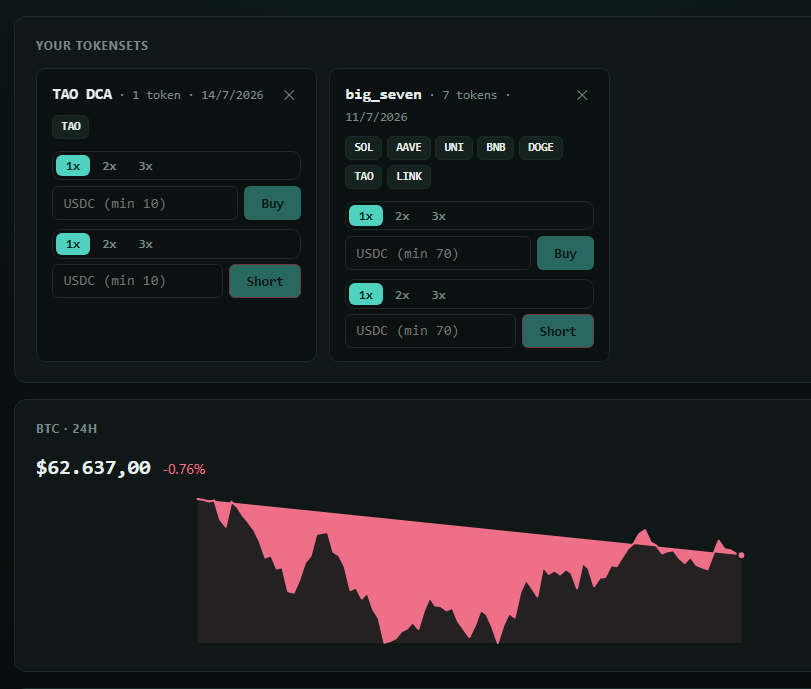

# Hyperliquid Tokensets

Web app to assemble, buy, hold, and sell **baskets of spot tokens ("tokensets")** on
Hyperliquid, using a browser wallet (Rabby / MetaMask) for authentication, with
per-token and per-lot P&L tracking.

> **Testnet-first.** The app defaults to Hyperliquid **testnet**. Switching to mainnet is
> explicit (`VITE_HL_NETWORK=mainnet`) and shown by an always-visible network banner.

## Live

| | |
|---|---|
| 🧪 **Testnet** | **[jzafrap.github.io/hyperliquid-altcoin-portfolio/testnet/](https://jzafrap.github.io/hyperliquid-altcoin-portfolio/testnet/)** — practice with testnet funds, start here |
| ⚠️ **Mainnet** | **[jzafrap.github.io/hyperliquid-altcoin-portfolio/mainnet/](https://jzafrap.github.io/hyperliquid-altcoin-portfolio/mainnet/)** — real funds, real trades |

Both are static builds redeployed automatically on every push to `main` (see
[`.github/workflows/deploy-pages.yml`](./.github/workflows/deploy-pages.yml)); no
backend, no build-time secrets — your wallet's private key never leaves your wallet.



## Status

Testnet-ready, end to end. Implemented:

- Environment switch (testnet-first) with a visible network banner
- **Spot and perpetuals**, with **1x/2x/3x leverage** and long or short, via a
  market-type selector
- Wallet connect (Rabby/MetaMask) — no keys stored
- Agent (API) wallet signing: one approval, in-memory trade-only key
- Tokenset CRUD, persisted per network + market type + wallet
- Token picker with liquidity indicators (24h volume, spread, depth)
- Equal-split market **buy/short** (spot buy / perp long or short at 1x-3x
  leverage; min-total guard, IOC)
- Per-lot percentage **sell/cover** (25/50/100%; reduceOnly, labeled by side) with
  a colored leverage badge (`PERPS · BUY 2x` / `PERPS · SELL 3x`) per lot
- Live P&L dashboard (per token, per lot, per-tokenset aggregate) + hide small balances
- BTC 24h price chart for quick market context
- Edge-case guards: insufficient funds, price staleness, partial fills

All money paths are covered by unit tests and were adversarially reviewed.

## Documentation

Full docs live in **[`docs/`](./docs/README.md)**:

| Doc | For |
|-----|-----|
| [Getting Started](./docs/getting-started.md) | Install, configure, run, first trade. |
| [User Guide](./docs/user-guide.md) | Every feature, step by step. |
| [Trading Model](./docs/trading-model.md) | How buys/sells are sized, priced, recorded. |
| [Architecture](./docs/architecture.md) | Code layout and data flow. |
| [Security](./docs/security.md) | Key model, trust boundary, limitations. |
| [Development](./docs/development.md) | Local setup, testing, workflow. |
| [Hyperliquid Reference](./docs/hyperliquid-reference.md) | Verified API facts and gotchas. |

See [`instructions.md`](./instructions.md) for the original build spec and committed
design decisions, and [`CHANGELOG.md`](./CHANGELOG.md) for recent changes.

## Stack

React 19 · Vite · TypeScript · wagmi + viem · [`@nktkas/hyperliquid`](https://github.com/nktkas/hyperliquid) · TanStack Query · Zustand · Vitest

## Getting started

```bash
npm install
cp .env.example .env   # defaults to testnet
npm run dev
```

Other scripts:

```bash
npm run typecheck   # tsc -b
npm test            # vitest run
npm run build       # production build
```

## Security posture

- The user's main private key is never requested, stored, or transmitted.
- Trading uses a Hyperliquid **agent (API) wallet**: the main wallet signs one approval;
  a delegated, trade-only key (kept **only in session memory**) signs orders. It cannot
  withdraw funds. See `instructions.md` §3.
